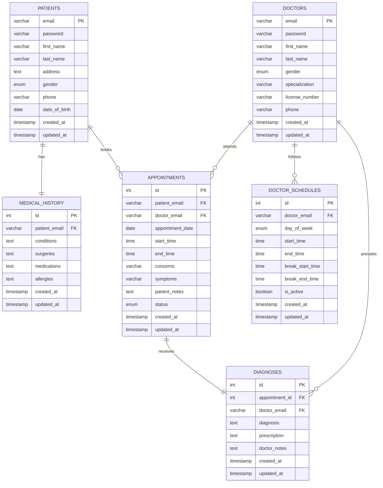

# Meditrack - Hospital Management System

**Student:** Nidhi Wagh  
**MIS:** 111803106  
**Class:** TYCOM Division 1  
**Course:** Database Management Systems (DBMS)  
**Academic Year:** 2020-2021

## Project Overview

Meditrack is a comprehensive hospital management system designed to streamline healthcare operations through efficient database management. This project demonstrates the practical application of database concepts in real-world healthcare scenarios, showcasing how proper data organization can improve patient care and hospital efficiency.

## Key Features

### For Patients
- **Secure Authentication** - Individual patient accounts with encrypted login
- **Appointment Management** - Easy booking, rescheduling, and cancellation of appointments
- **Medical History Tracking** - Comprehensive record of past treatments, medications, and conditions
- **Real-time Updates** - Instant notifications about appointment status and doctor availability
- **Privacy Protection** - Medical records accessible only to assigned doctors

### For Healthcare Providers
- **Doctor Dashboard** - Centralized view of patient appointments and schedules
- **Patient Management** - Complete access to patient profiles and medical histories
- **Diagnosis System** - Digital prescription and diagnosis management
- **Schedule Optimization** - Automated conflict prevention and time slot management
- **Medical Documentation** - Secure storage and retrieval of patient data

## Technical Architecture

### Frontend
- **React.js** - Modern, responsive user interface
- **Material-UI** - Professional healthcare-themed design
- **Redux Toolkit** - Efficient state management
- **React Router** - Seamless navigation between modules

### Backend
- **Node.js & Express** - Robust server architecture
- **JWT Authentication** - Secure user session management
- **RESTful API** - Clean, standardized data communication
- **Input Validation** - Comprehensive data integrity checks

### Database
- **MySQL** - Reliable relational database management
- **Normalized Schema** - Optimized data structure following 3NF principles
- **Referential Integrity** - Consistent data relationships and constraints
- **Indexed Queries** - Fast data retrieval and reporting

## Database Design

The system implements a well-structured relational database with the following core entities:



## System Screenshots

### Patient Portal


*Secure patient authentication portal*


*Comprehensive patient dashboard with appointment overview*


*Intuitive appointment scheduling with doctor selection*


*Detailed appointment view with patient notes and status*


*Complete medical history management interface*

### Healthcare Provider Portal


*Healthcare provider's centralized management console*


*Doctor's appointment management and patient queue*


*Comprehensive patient information and medical history access*

## Installation & Setup

### Prerequisites
- Node.js (v14 or higher)
- MySQL Server (v8.0 or higher)
- Git

### Quick Start

1. **Clone the repository**
   ```bash
   git clone https://github.com/nidhi76/Meditrack.git
   cd Meditrack
   ```

2. **Database setup**
   ```bash
   # Create database
   mysql -u root -p
   CREATE DATABASE meditrack_db;
   CREATE USER 'meditrack_user'@'localhost' IDENTIFIED BY 'meditrack_password';
   GRANT ALL PRIVILEGES ON meditrack_db.* TO 'meditrack_user'@'localhost';
   FLUSH PRIVILEGES;
   ```

3. **Backend setup**
   ```bash
   cd api
   npm install
   npm start
   ```

4. **Frontend setup**
   ```bash
   cd web
   npm install
   npm start
   ```

5. **Access the application**
   - Open your browser and navigate to `http://localhost:3000`

## Demo Credentials

### Healthcare Providers
- **Dr. Smith (Cardiology)**
  - Email: `dr.smith@meditrack.com`
  - Password: `password123`

- **Dr. Johnson (Pediatrics)**
  - Email: `dr.johnson@meditrack.com`
  - Password: `password123`

- **Dr. Nidhi Wagh (General Medicine)**
  - Email: `nidhi.wagh@meditrack.com`
  - Password: `password123`

### Patients
- **Nidhi Wagh (Demo Patient)**
  - Email: `nidhi.wagh@example.com`
  - Password: `password123`

- **Sample Patient**
  - Email: `patient1@example.com`
  - Password: `password123`

## Project Highlights

- **Database Normalization** - Implements 3NF for optimal data organization
- **Security Implementation** - JWT-based authentication with password encryption
- **Responsive Design** - Mobile-friendly interface for all devices
- **Real-time Updates** - Live appointment status and availability
- **Data Integrity** - Comprehensive validation and error handling
- **Scalable Architecture** - Modular design for easy feature expansion

## Learning Outcomes

This project demonstrates practical application of:
- **Database Design Principles** - Entity relationships and normalization
- **Web Development** - Full-stack application development
- **API Design** - RESTful service architecture
- **User Experience** - Intuitive healthcare management interfaces
- **Security Practices** - Authentication and data protection

## Future Enhancements

- Integration with medical devices
- Advanced reporting and analytics
- Mobile application development
- Telemedicine capabilities
- Electronic health record (EHR) integration

---

**Project Information:**
- **Developer:** Nidhi Wagh (MIS: 111803106)
- **Institution:** TYCOM Division 1
- **Course:** Database Management Systems (DBMS)
- **Project Period:** November 2020
- **Academic Year:** 2020-2021