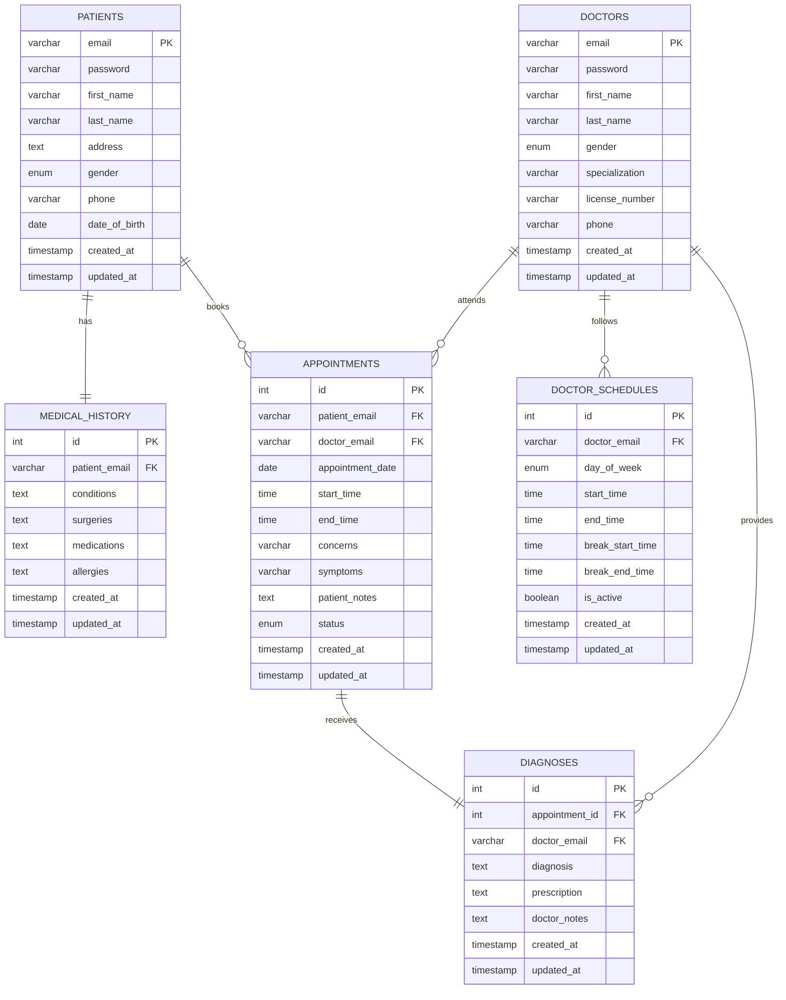
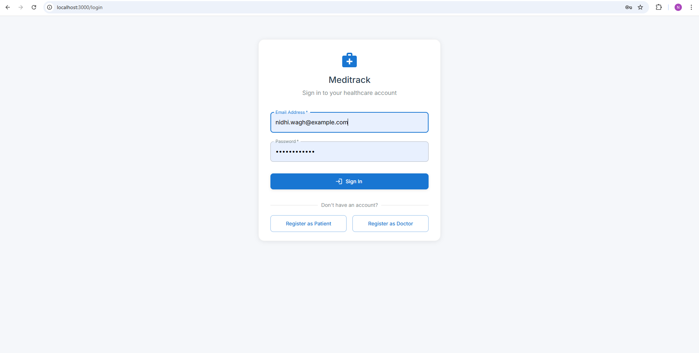
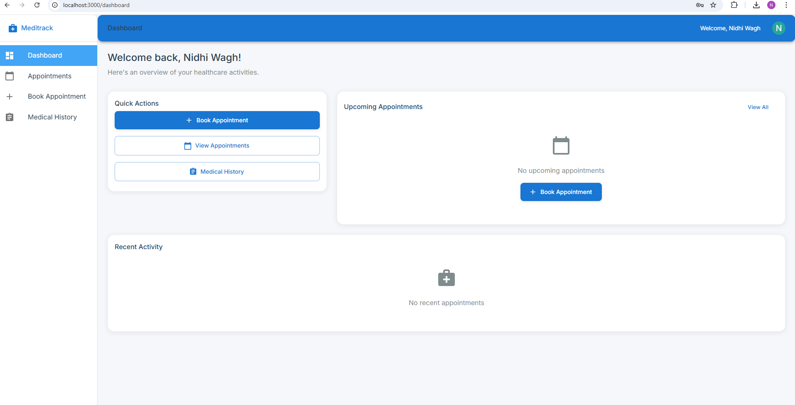
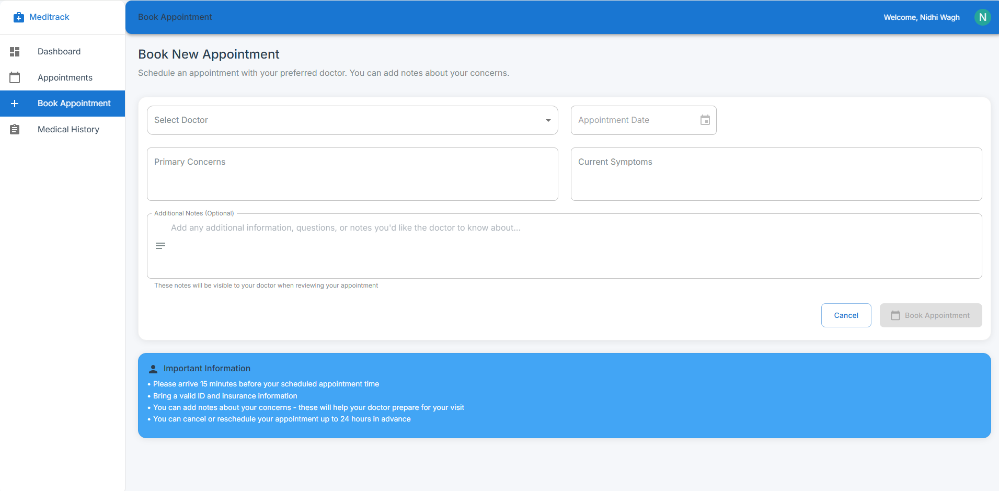
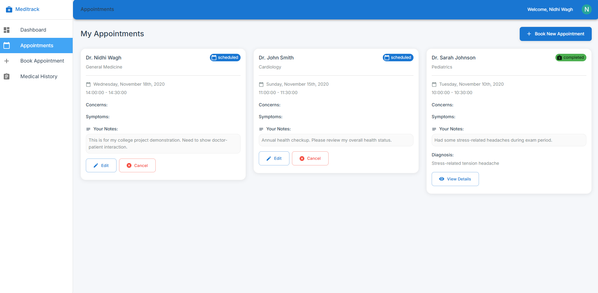
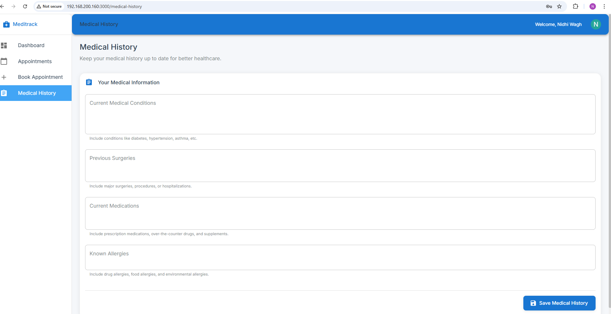
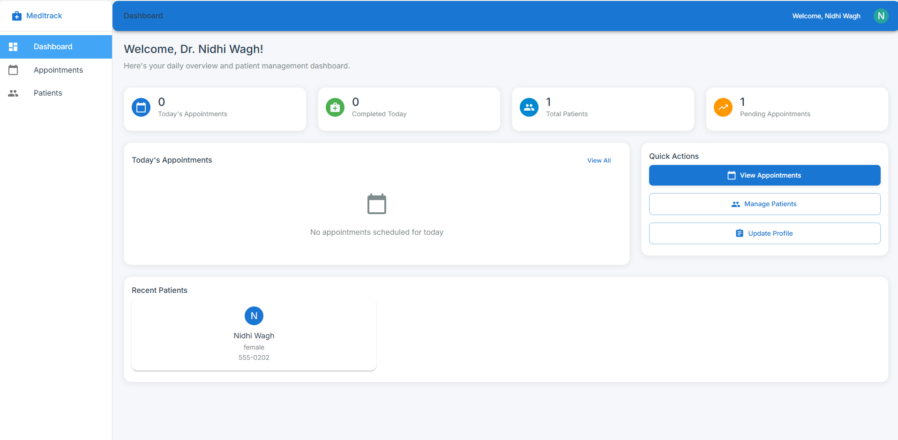
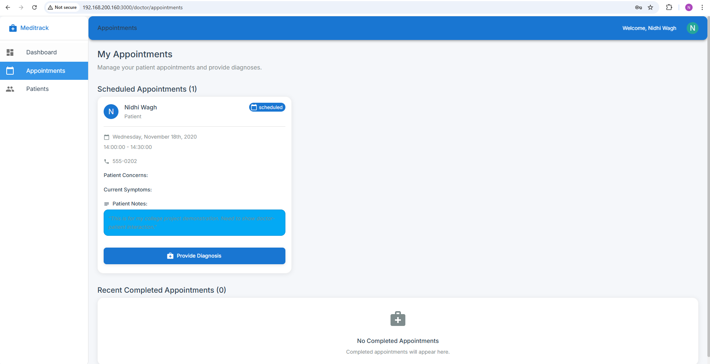
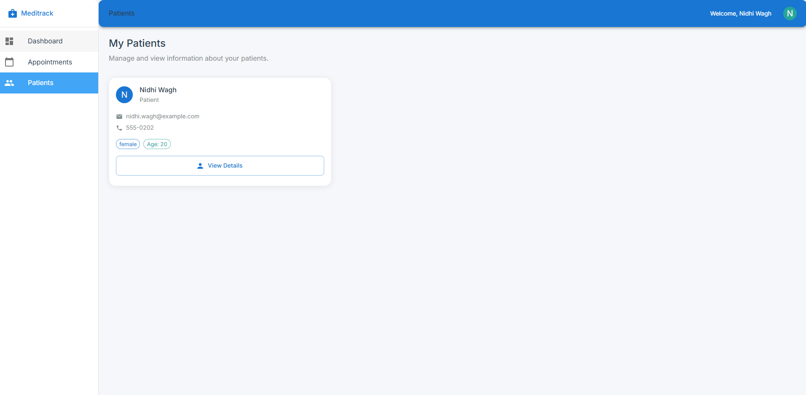

# Hospital Management System - DBMS Project

**Name:** Nidhi Wagh  
**MIS:** 111803106  
**Class:** TY Comp Div 2  
**Course:** Database Management Systems (DBMS) - Sem 5 Project

Hospital Management System made for Sem 5 DBMS Course Project.

Hospitals interact with a lot of people in a day and there are various activities involved in day to day operations of hospitals, for example booking of appointments, managing doctor schedules, managing patient diagnoses, managing medical histories of patients, etc. The aim of this project is to show how data related to these tasks can be made easier to manage using databases.

## Technologies Used

- **Frontend:** React.js
- **Backend:** Node.js, Express
- **Database:** MySQL

## ER Diagram

## Patient Side Features

1. There is a separate interface for patients. Patients have a separate login.
2. Patients can book appointments.
3. Patients can give previous medical history.
4. Patients can view/update/cancel already booked appointments if necessary.
5. Cancelled appointments create free slots for other patients.
6. The system avoids clash of appointments with other patients. Each patient is therefore ensured his/her slot.
7. Patients are able to see complete diagnosis, prescriptions and medical history.
8. Patient medical history is only available to the doctor with whom the appointment is booked to ensure privacy.

## Doctor Side Features

1. There is a separate interface for doctors. Doctors have a separate login.
2. The system takes into consideration doctor schedules and does not allow appointments when a doctor is already busy or has a break.
3. Doctors are able to access patient history and profile, and add to patient history.
4. Doctors are able to give diagnosis and prescriptions.
5. Doctors are able to modify diagnosis and prescriptions.

## Screenshots

### Patient Interface

_Patient Login Screen_

_Patient Home Screen_

_Patient Scheduling Appointment_

_Patient Viewing Appointments_

_Patient Viewing History_

### Doctor Interface

_Doctor Home Screen_

_Doctor Viewing Appointment_

_Doctor Viewing Patient History_

## Instructions to Run

1. Run `npm install` in both `api` and `web` directories.
2. Run `npm start` first in the `api` directory and then in the `web` directory.
3. Access `localhost:3000` from the browser.

## Default Login Credentials

### Doctors:

- Email: `dr.smith@meditrack.com` | Password: `password123`
- Email: `dr.johnson@meditrack.com` | Password: `password123`
- Email: `nidhi.wagh@meditrack.com` | Password: `password123`

### Patients:

- Email: `nidhi.wagh@example.com` | Password: `password123`
- Email: `patient1@example.com` | Password: `password123`
