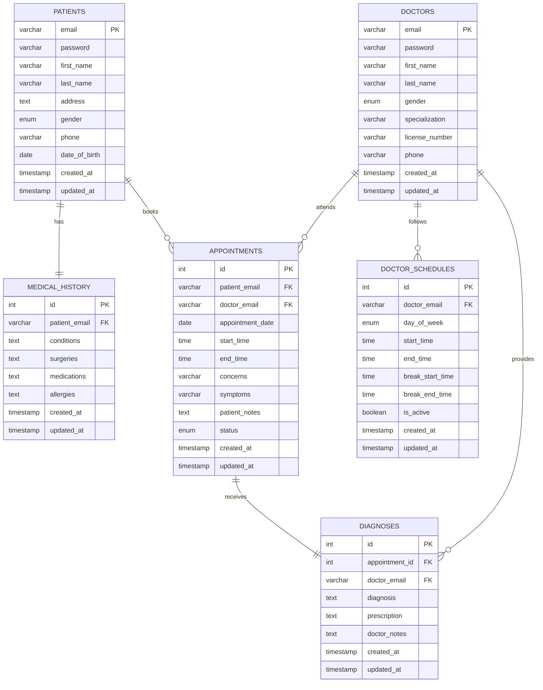
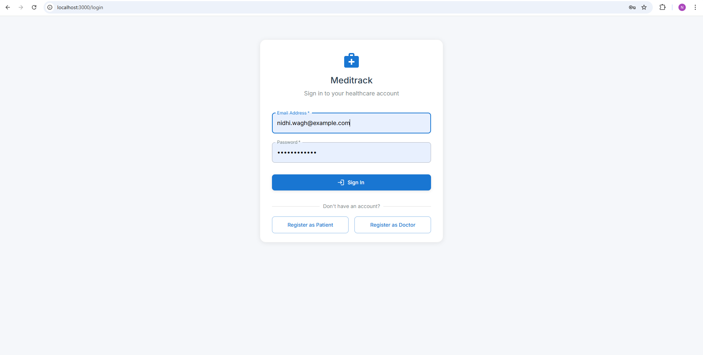
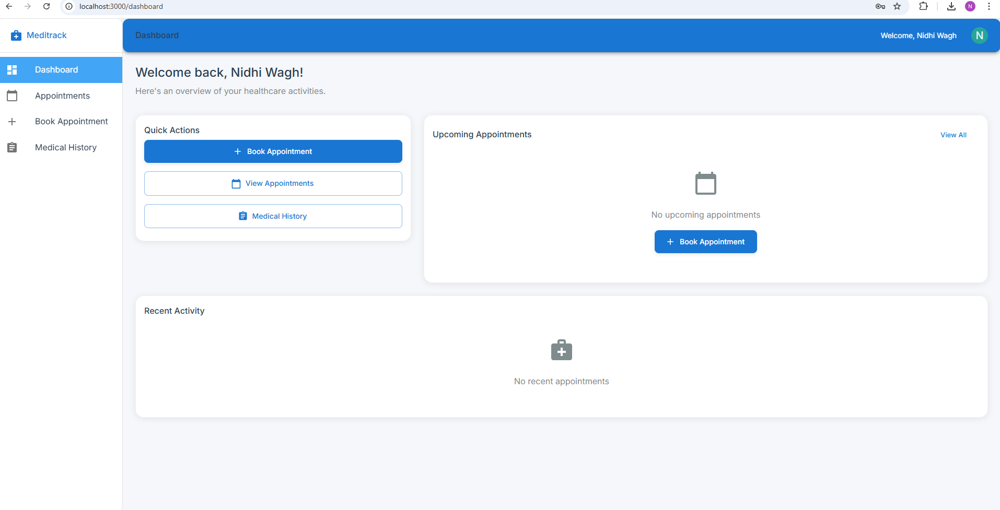
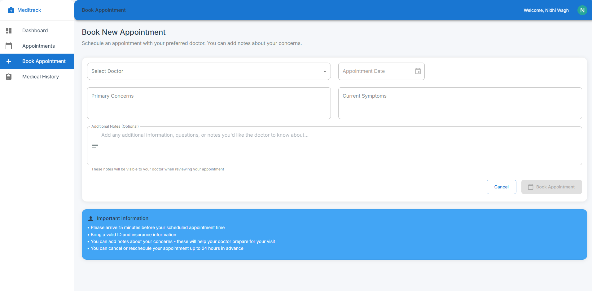
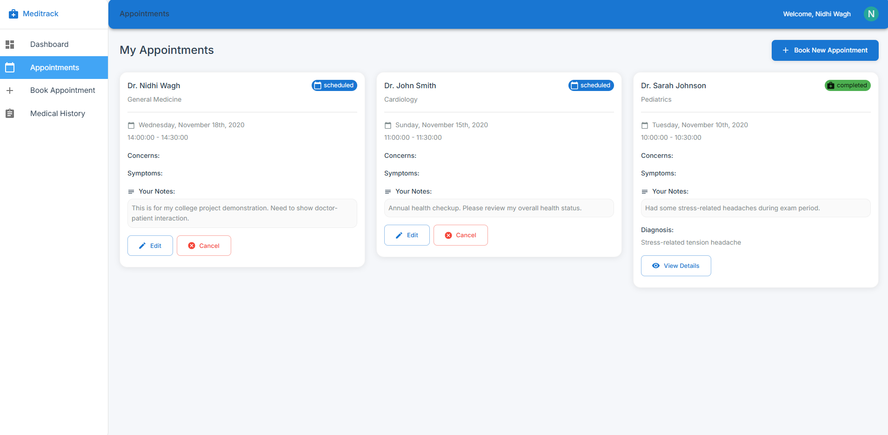
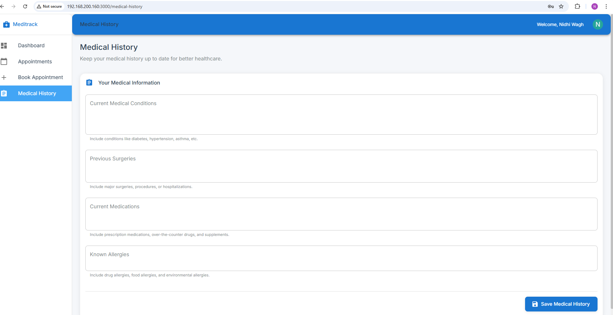
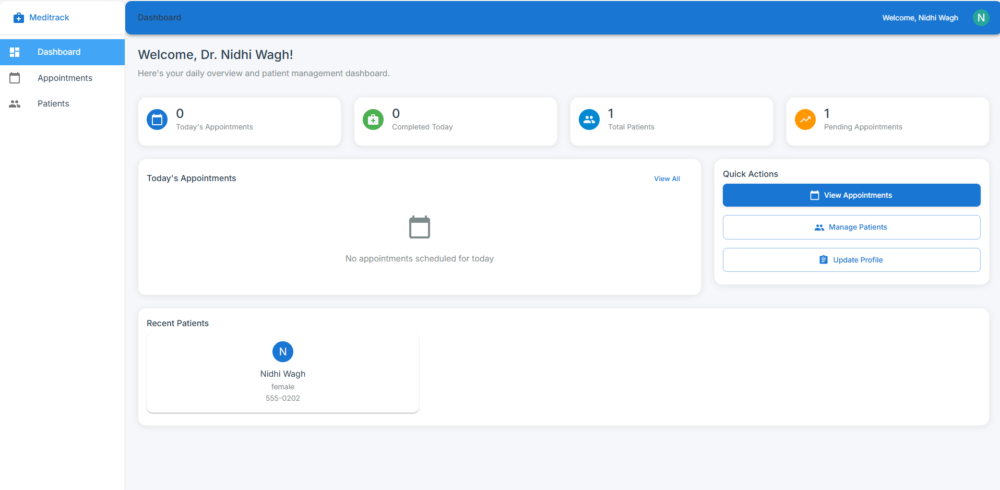
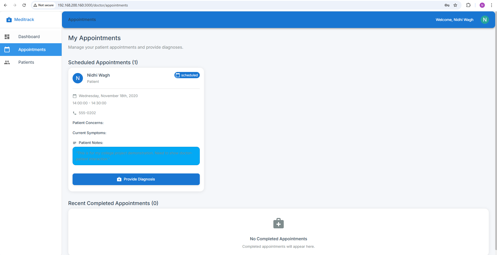
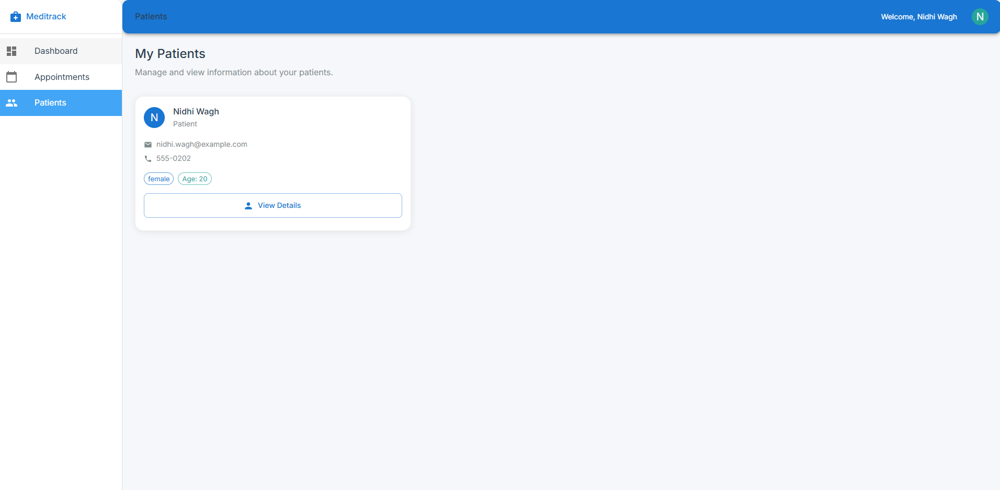

# Meditrack - Hospital Management System

**Student:** Nidhi Wagh  
**MIS:** 111803106  
**Class:** TY COMP Division 1  
**Course:** Database Management Systems (DBMS)  
**Academic Year:** 2020-2021

## Project Overview

Meditrack is a hospital management system that helps manage patient appointments, doctor schedules, and medical records. This project shows how databases can make hospital operations easier.

## Key Features

### For Patients

- **Login System** - Patients can create accounts and log in
- **Book Appointments** - Patients can book appointments with doctors
- **Medical History** - Patients can view and update their medical records
- **Appointment Management** - Patients can see, change, or cancel appointments

### For Doctors

- **Doctor Login** - Doctors have their own login system
- **Patient Management** - Doctors can see patient information and medical history
- **Appointment Management** - Doctors can see their appointment schedule
- **Diagnosis System** - Doctors can give diagnoses and prescriptions

## Technologies Used

- **Frontend:** React.js
- **Backend:** Node.js, Express
- **Database:** MySQL

## Database Design

The system uses a MySQL database with the following main tables:



## Screenshots

### Patient Interface


_Patient login page_


_Patient home screen_


_Book appointment form_


_View appointments_


_Medical history form_

### Doctor Interface


_Doctor home screen_


_Doctor appointment list_


_Doctor viewing patient profile_

## How to Run

1. **Install Dependencies**

   ```bash
   cd api
   npm install

   cd web
   npm install
   ```

2. **Start the Application**

   ```bash
   # Start backend
   cd api
   npm start

   # Start frontend
   cd web
   npm start
   ```

3. **Access the Application**
   - Open your browser and go to `http://localhost:3000`

## Login Credentials

### Doctors

- Email: `dr.smith@meditrack.com` | Password: `password123`
- Email: `dr.johnson@meditrack.com` | Password: `password123`
- Email: `nidhi.wagh@meditrack.com` | Password: `password123`

### Patients

- Email: `nidhi.wagh@example.com` | Password: `password123`
- Email: `patient1@example.com` | Password: `password123`

---

**Project Information:**

- **Developer:** Nidhi Wagh (MIS: 111803106)
- **Institution:** TY COMP Division 1
- **Course:** Database Management Systems (DBMS)
- **Project Period:** November 2020
- **Academic Year:** 2020-2021
