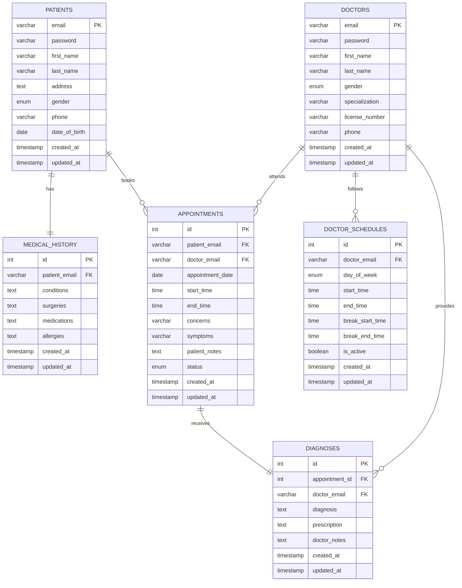

# Meditrack System - Entity Relationship Diagram

**Student:** Nidhi Wagh  
**MIS:** 111803106  
**Course:** Database Management Systems (DBMS)  
**Project:** Hospital Management System  
**Academic Year:** 2020-2021

## Visual ER Diagram



## ER Diagram Description

### Entities and Attributes

#### 1. PATIENT

**Attributes:**

- email (PK)
- password
- first_name
- last_name
- address
- gender
- phone
- date_of_birth
- created_at
- updated_at

#### 2. DOCTOR

**Attributes:**

- email (PK)
- password
- first_name
- last_name
- gender
- specialization
- license_number
- phone
- created_at
- updated_at

#### 3. APPOINTMENT

**Attributes:**

- id (PK)
- patient_email (FK)
- doctor_email (FK)
- appointment_date
- start_time
- end_time
- concerns
- symptoms
- patient_notes
- status
- created_at
- updated_at

#### 4. MEDICAL_HISTORY

**Attributes:**

- id (PK)
- patient_email (FK)
- conditions
- surgeries
- medications
- allergies
- created_at
- updated_at

#### 5. DIAGNOSIS

**Attributes:**

- id (PK)
- appointment_id (FK)
- doctor_email (FK)
- diagnosis
- prescription
- doctor_notes
- created_at
- updated_at

#### 6. DOCTOR_SCHEDULE

**Attributes:**

- id (PK)
- doctor_email (FK)
- day_of_week
- start_time
- end_time
- break_start_time
- break_end_time
- is_active
- created_at
- updated_at

---

## Relationships

### 1. PATIENT — APPOINTMENT

- **Type**: One-to-Many
- **Description**: One patient can have multiple appointments
- **Cardinality**: 1:N
- **Foreign Key**: appointment.patient_email → patient.email

### 2. DOCTOR — APPOINTMENT

- **Type**: One-to-Many
- **Description**: One doctor can have multiple appointments
- **Cardinality**: 1:N
- **Foreign Key**: appointment.doctor_email → doctor.email

### 3. PATIENT — MEDICAL_HISTORY

- **Type**: One-to-One
- **Description**: Each patient has one medical history record
- **Cardinality**: 1:1
- **Foreign Key**: medical_history.patient_email → patient.email

### 4. APPOINTMENT — DIAGNOSIS

- **Type**: One-to-One
- **Description**: Each appointment has one diagnosis record
- **Cardinality**: 1:1
- **Foreign Key**: diagnosis.appointment_id → appointment.id

### 5. DOCTOR — DIAGNOSIS

- **Type**: One-to-Many
- **Description**: One doctor can provide multiple diagnoses
- **Cardinality**: 1:N
- **Foreign Key**: diagnosis.doctor_email → doctor.email

### 6. DOCTOR — DOCTOR_SCHEDULE

- **Type**: One-to-Many
- **Description**: One doctor has multiple schedule entries (one per day)
- **Cardinality**: 1:N
- **Foreign Key**: doctor_schedule.doctor_email → doctor.email

---

## ER Diagram (Textual Representation)

```
┌─────────────┐
│   PATIENT   │
├─────────────┤
│ email (PK)  │
│ password    │
│ first_name  │
│ last_name   │
│ address     │
│ gender      │
│ phone       │
└─────────────┘
       │
       │ 1
       │
       │ has
       │
       │ N
       ▼
┌─────────────────┐
│  MEDICAL_HISTORY│
├─────────────────┤
│ id (PK)         │
│ patient_email(FK)│
│ conditions      │
│ surgeries       │
│ medications     │
│ allergies       │
└─────────────────┘


┌─────────────┐                    ┌──────────────┐
│   PATIENT   │────────────────────│ APPOINTMENT  │
└─────────────┘  books         1:N ├──────────────┤
                                    │ id (PK)      │
                                    │ patient_email│
┌─────────────┐                    │ doctor_email │
│   DOCTOR    │────────────────────│ date         │
└─────────────┘  attends       1:N │ start_time   │
                                    │ end_time     │
                                    │ concerns     │
                                    │ symptoms     │
                                    │ patient_notes│
                                    │ status       │
                                    └──────────────┘
                                           │
                                           │ 1
                                           │
                                           │ has
                                           │
                                           │ 1
                                           ▼
                                    ┌──────────────┐
                                    │  DIAGNOSIS   │
                                    ├──────────────┤
                                    │ id (PK)      │
                                    │ appt_id (FK) │
                                    │ doctor_email │
                                    │ diagnosis    │
                                    │ prescription │
                                    │ doctor_notes │
                                    └──────────────┘
```
